# Test Strategy Document

## 1. Executive Summary

**Purpose**: This document defines the overall testing approach, methodologies, and best practices for [Organization Name].

**Scope**: All software development and maintenance projects within the organization.

**Objectives**:
- Ensure software quality and reliability
- Minimize defects in production
- Establish standardized testing processes
- Build a quality-focused culture

---

## 2. Testing Process Overview

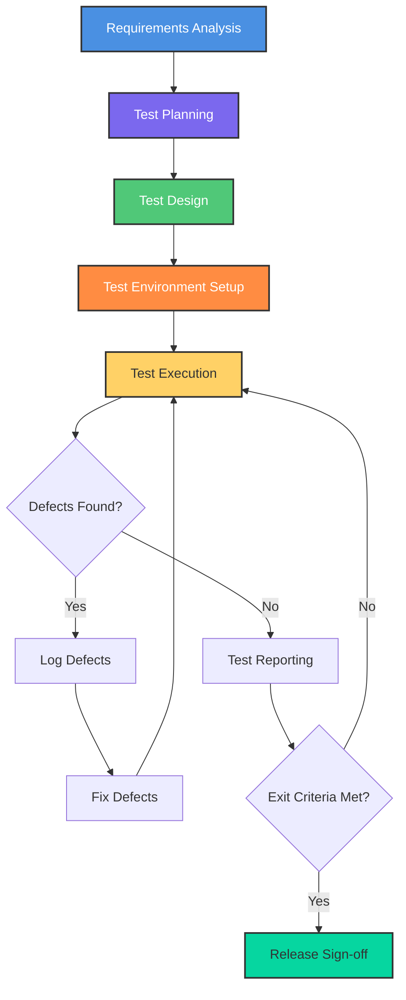

---

## 3. Testing Pyramid Strategy

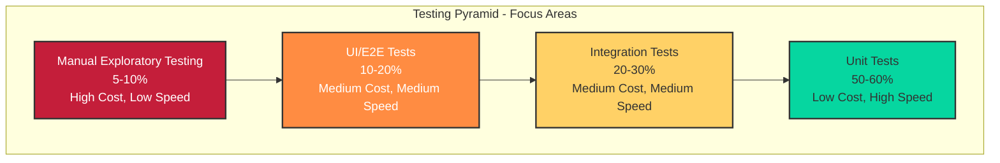

---

## 4. Testing Types and Best Practices

### 4.1 Unit Testing

**Definition**: Testing individual components or functions in isolation.

**When to Perform**: During development phase, continuously.

**Best Practices**:
- Developers write unit tests for their own code
- Aim for 70-80% code coverage minimum
- Use testing frameworks (JUnit, NUnit, pytest, Jest)
- Follow AAA pattern: Arrange, Act, Assert
- Keep tests isolated and independent
- Run tests automatically on every code commit
- Mock external dependencies
- Test both positive and negative scenarios
- Keep tests fast (milliseconds per test)

**Responsibilities**: Development team

---

### 4.2 Integration Testing

**Definition**: Testing interactions between integrated components or systems.

**When to Perform**: After unit testing, when components are combined.

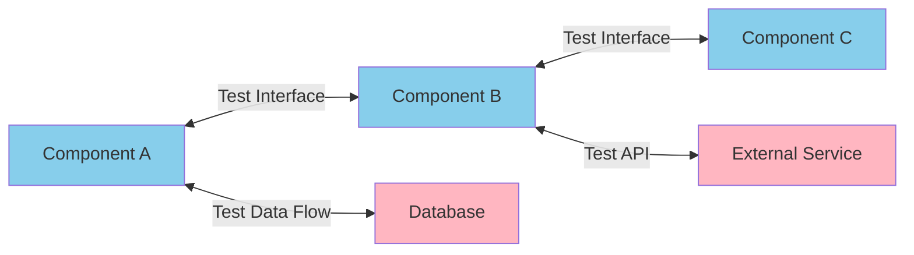

**Best Practices**:
- Test interfaces between modules
- Use incremental integration approach (build and test gradually)
- Test data flow between components
- Verify API contracts and responses
- Test database interactions
- Use test databases, not production
- Implement both top-down and bottom-up integration
- Automate integration test suites
- Test error handling between components
- Document integration points clearly

**Responsibilities**: Development and QA teams

---

### 4.3 System Testing

**Definition**: Testing the complete integrated system against requirements.

**When to Perform**: After integration testing, before UAT.

**Best Practices**:
- Test in an environment that mirrors production
- Validate end-to-end business workflows
- Test all functional requirements
- Verify system behavior under normal conditions
- Use requirement traceability matrix
- Execute both functional and non-functional tests
- Follow test cases derived from requirements
- Document all defects with reproduction steps
- Perform regression testing after fixes
- Get sign-off before moving to UAT

**Responsibilities**: QA team

---

### 4.4 User Acceptance Testing (UAT)

**Definition**: Validation by end users to ensure system meets business needs.

**When to Perform**: After system testing, before production deployment.

**Best Practices**:
- Involve actual end users or business representatives
- Test real-world scenarios and workflows
- Provide realistic test data
- Create user-friendly test scripts
- Allow sufficient time for UAT (don't rush)
- Document business process validations
- Gather formal sign-off from stakeholders
- Track and prioritize UAT feedback
- Test in a production-like environment
- Include training during UAT phase

**Responsibilities**: Business users with QA support

---

### 4.5 Regression Testing

**Definition**: Re-testing to ensure new changes haven't broken existing functionality.

**When to Perform**: After any code changes, bug fixes, or enhancements.

**Best Practices**:
- Maintain a regression test suite
- Prioritize test cases based on risk and business criticality
- Automate regression tests wherever possible
- Update test suite when new features are added
- Run regression tests before every release
- Focus on high-risk and frequently used features
- Use version control for test scripts
- Execute both automated and manual regression tests
- Define clear entry and exit criteria
- Schedule regular regression cycles

**Responsibilities**: QA team

---

### 4.6 Performance Testing

**Definition**: Testing system behavior under various load conditions.

**When to Perform**: After functional testing, before production release.

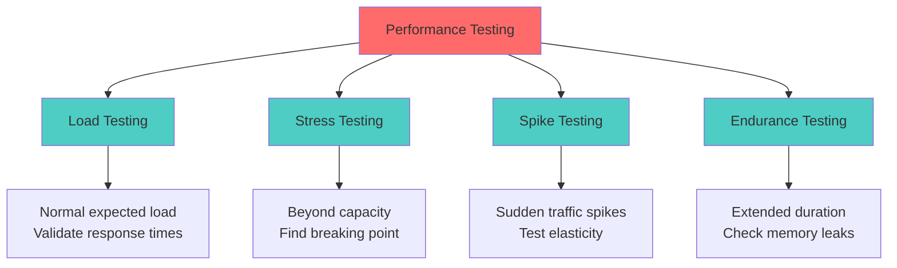

**Best Practices**:
- Define performance benchmarks and SLAs
- Test with realistic load scenarios
- Include load, stress, spike, and endurance testing
- Use production-like data volumes
- Monitor system resources (CPU, memory, database)
- Test at expected and peak loads
- Identify bottlenecks early
- Use performance testing tools (JMeter, LoadRunner, Gatling)
- Test third-party integrations under load
- Document performance baselines

**Responsibilities**: QA team with infrastructure support

---

### 4.7 Security Testing

**Definition**: Testing to identify vulnerabilities and security risks.

**When to Perform**: Throughout development, especially before production.

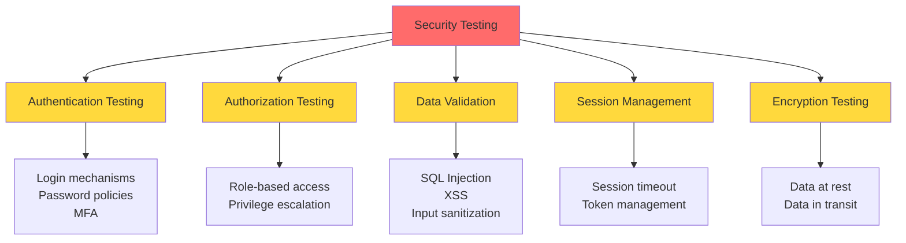

**Best Practices**:
- Follow OWASP Top 10 guidelines
- Test authentication and authorization mechanisms
- Validate input validation and sanitization
- Test for SQL injection, XSS, CSRF vulnerabilities
- Perform penetration testing periodically
- Test data encryption (at rest and in transit)
- Verify secure session management
- Test API security and rate limiting
- Conduct security code reviews
- Use automated security scanning tools
- Maintain security testing checklist
- Ensure compliance with regulations (GDPR, HIPAA, etc.)

**Responsibilities**: Security team with QA and development support

---

### 4.8 Smoke Testing (Build Verification)

**Definition**: Quick, shallow testing to verify basic functionality after deployment.

**When to Perform**: After every build deployment.

**Best Practices**:
- Keep smoke tests lightweight and fast (15-30 minutes)
- Test critical paths only
- Automate smoke test suite
- Execute before detailed testing begins
- Include login, core features, and basic workflows
- Fail fast if smoke tests fail
- Document smoke test criteria clearly
- Run in all environments (dev, QA, staging)
- Include database connectivity checks
- Verify key integrations are working

**Responsibilities**: QA team

---

### 4.9 Exploratory Testing

**Definition**: Unscripted testing to discover defects through exploration.

**When to Perform**: Throughout testing cycles, especially for new features.

**Best Practices**:
- Allocate time for exploratory sessions (time-boxed)
- Use session-based test management
- Document findings during exploration
- Focus on user experience and edge cases
- Encourage tester creativity
- Use charters to guide exploration
- Pair testers for better coverage
- Target high-risk or complex areas
- Log all defects with reproduction steps
- Combine with scripted testing, not replace it

**Responsibilities**: QA team

---

### 4.10 API Testing

**Definition**: Testing application programming interfaces directly.

**When to Perform**: During and after development of APIs.

**Best Practices**:
- Test all HTTP methods (GET, POST, PUT, DELETE)
- Validate response codes and payloads
- Test authentication and authorization
- Verify error handling and edge cases
- Use tools like Postman, REST Assured, SoapUI
- Test API performance and rate limiting
- Validate schema and data types
- Test with invalid and boundary data
- Automate API test suites
- Document API test coverage
- Test API versioning

**Responsibilities**: Development and QA teams

---

### 4.11 Database Testing

**Definition**: Validating data integrity, schema, and database operations.

**When to Perform**: During development and integration testing.

**Best Practices**:
- Verify data integrity and consistency
- Test CRUD operations thoroughly
- Validate stored procedures and triggers
- Check database schema changes
- Test data migration scripts
- Verify transaction management (ACID properties)
- Test database performance queries
- Validate referential integrity
- Test backup and recovery procedures
- Use separate test databases
- Validate data security and access controls

**Responsibilities**: QA and database teams

---

### 4.12 Compatibility Testing

**Definition**: Testing across different environments, browsers, and devices.

**When to Perform**: Before release, especially for web and mobile applications.

**Best Practices**:
- Test on all supported browsers and versions
- Test on different operating systems
- Verify mobile responsiveness
- Test on actual devices, not just emulators
- Check backward compatibility
- Test different screen sizes and resolutions
- Verify across different network conditions
- Use compatibility testing tools (BrowserStack, Sauce Labs)
- Document supported platforms clearly
- Prioritize based on user analytics

**Responsibilities**: QA team

---

## 5. Test Levels Flow

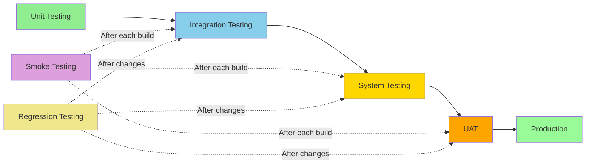

---

## 6. Test Environment Strategy

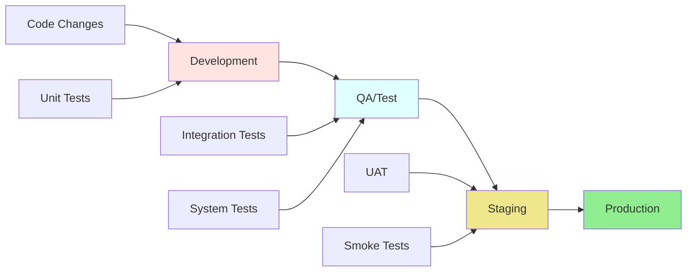

**Requirements**:
- Separate environments: Development, QA, Staging, Production
- QA environment should mirror production as closely as possible
- Controlled access and change management
- Environment refresh strategy
- Test data management approach
- Configuration management

---

## 7. Test Automation Strategy

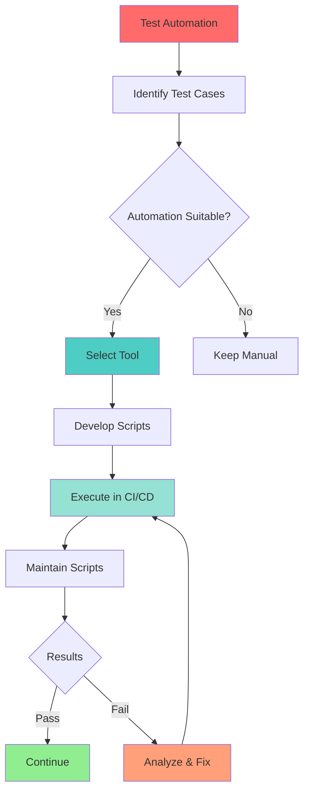

**Approach**:
- Start with automating regression tests
- Focus on stable, repetitive tests first
- Use appropriate tools for different testing types
- Maintain automation framework and scripts
- Aim for 60-70% automation coverage over time
- Run automated tests in CI/CD pipeline

**Tools to Consider**:
- Selenium/Playwright for web automation
- Appium for mobile automation
- JMeter/Gatling for performance testing
- Postman/REST Assured for API testing
- JUnit/TestNG/pytest for unit testing

---

## 8. Defect Management Lifecycle (Azure DevOps)

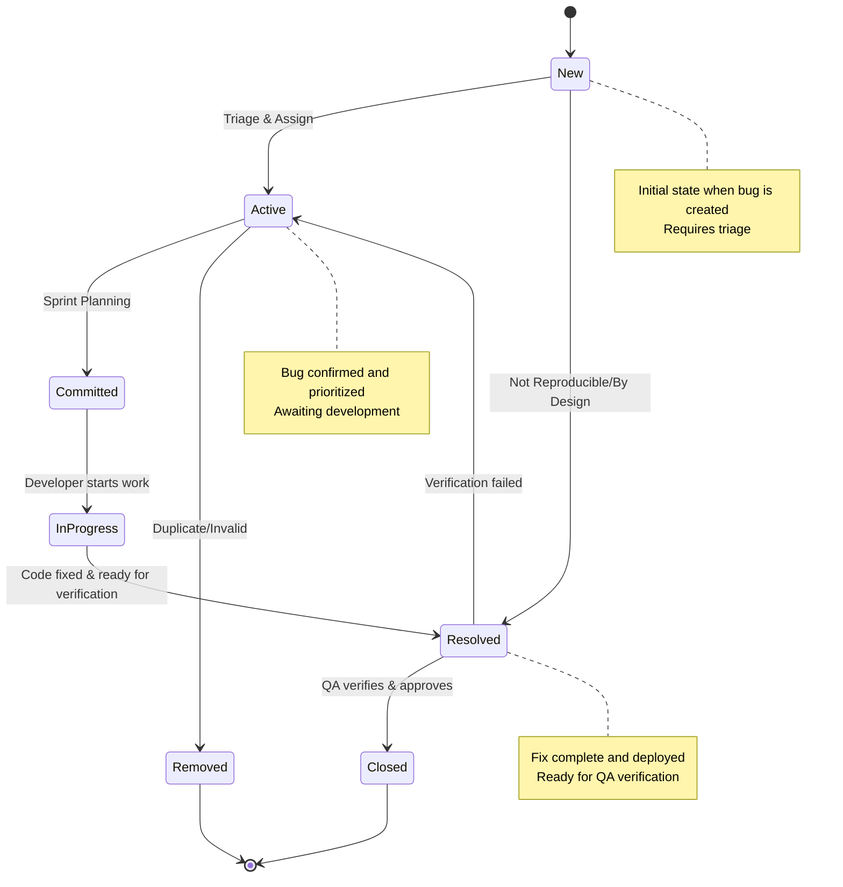

**Azure DevOps Bug States**:
- **New**: Bug just created, needs triage and assignment
- **Active**: Bug triaged, confirmed, and ready for work
- **Committed**: Bug committed to current sprint/iteration
- **Resolved**: Fix completed, deployed to test environment
- **Closed**: Fix verified by QA and approved
- **Removed**: Duplicate, invalid, or not a bug

**Process**:
- Log all defects in Azure DevOps as Bug work items
- Classify by severity (1-Critical, 2-High, 3-Medium, 4-Low)
- Include reproduction steps, screenshots, logs, and environment details
- Assign priority based on business impact
- Link bugs to related user stories/tasks
- Verify fixes before closing defects
- Track defect metrics and trends using ADO dashboards

---

## 9. Defect Severity Classification (Azure DevOps)

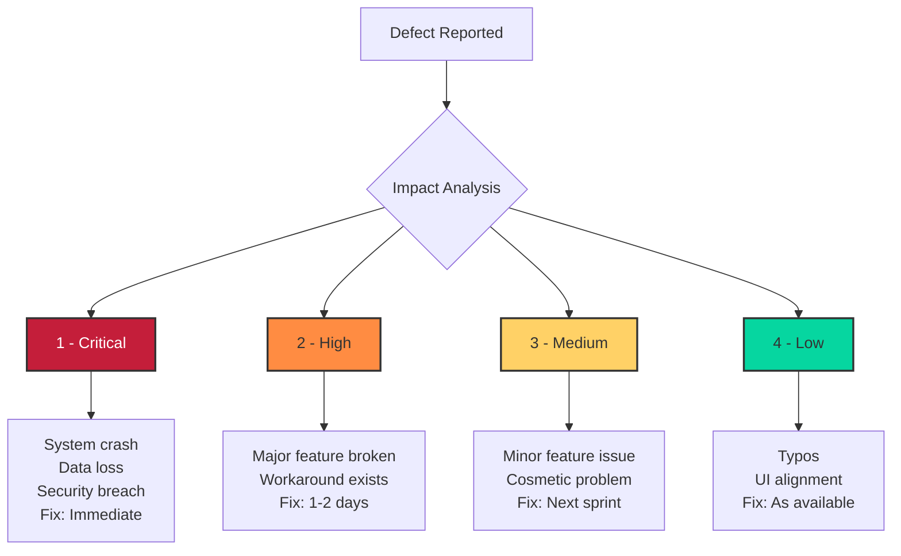

---

## 10. Test Documentation

**Required Documents**:
- Test Strategy (this document)
- Test Plans for each project
- Test Cases and Test Scripts
- Test Data specifications
- Defect Reports
- Test Summary Reports
- Traceability Matrix

---

## 11. Entry and Exit Criteria

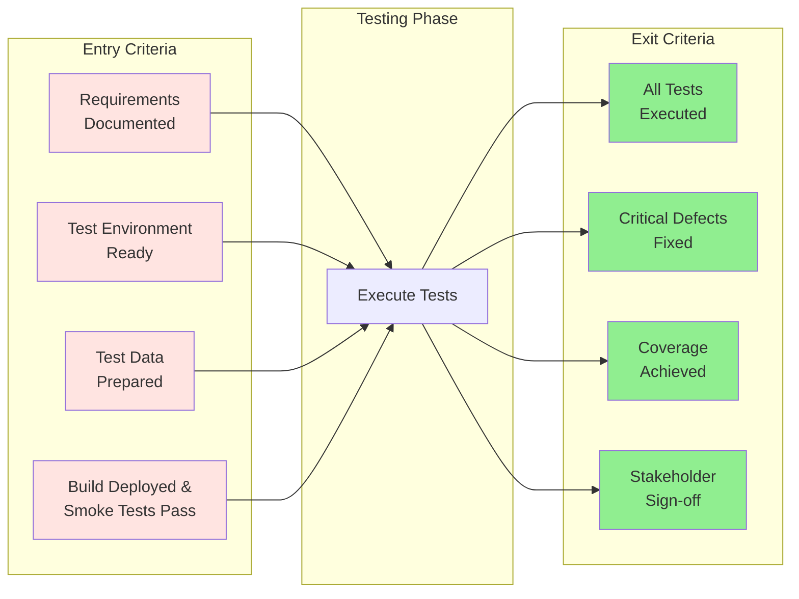

---

## 12. Roles and Responsibilities Matrix

| Role | Plan | Design | Execute | Report | Automate | Fix |
|------|------|--------|---------|--------|----------|-----|
| **Test Manager** | ✓ | ✓ | - | ✓ | - | - |
| **Test Lead** | ✓ | ✓ | ✓ | ✓ | ✓ | - |
| **Test Engineers** | - | ✓ | ✓ | ✓ | ✓ | - |
| **Developers** | - | ✓ (Unit) | ✓ (Unit) | - | ✓ (Unit) | ✓ |
| **Business Users** | - | - | ✓ (UAT) | - | - | - |

---

## 13. Key Metrics Dashboard

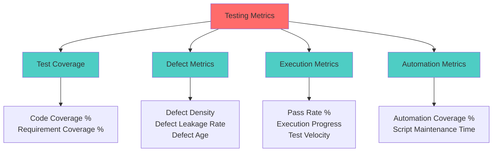

**Key Metrics**:
- Test coverage percentage
- Defect density (defects per module)
- Defect leakage to production
- Test execution progress
- Pass/fail rate
- Automation coverage
- Time to resolve defects

**Reporting Frequency**:
- Daily: Test execution status
- Weekly: Progress reports with metrics
- End of cycle: Test summary report

---

## 14. Risk Management

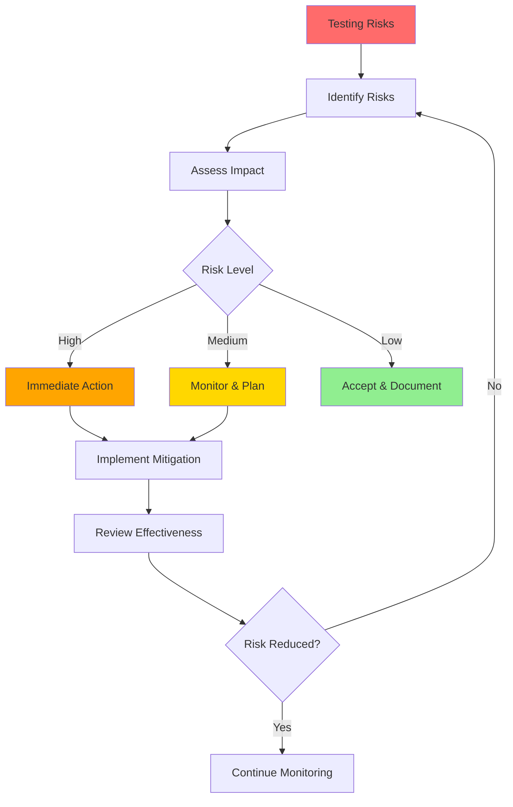

**Common Testing Risks**:
- Insufficient test coverage
- Environment unavailability
- Resource constraints
- Requirement changes
- Time constraints

**Mitigation Strategies**:
- Prioritize testing based on risk
- Maintain backup environments
- Cross-train team members
- Implement change control process
- Set realistic timelines with buffer

---

## 15. Implementation Roadmap

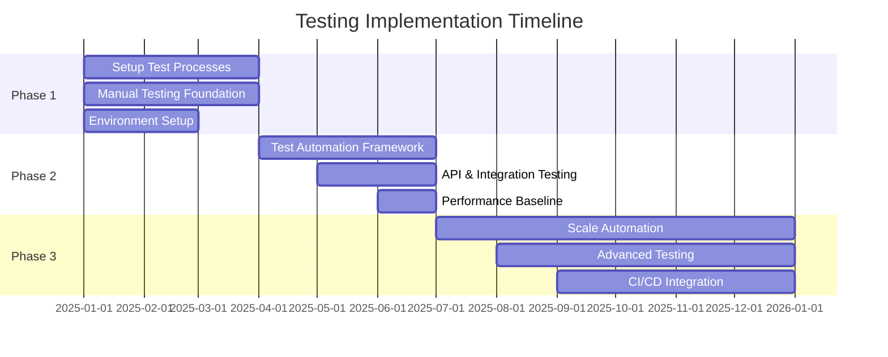

**Phase 1 (Months 1-3)**:
- Establish basic testing processes
- Implement manual testing for critical features
- Set up test environments
- Begin documenting test cases

**Phase 2 (Months 4-6)**:
- Introduce test automation for regression
- Implement API and integration testing
- Establish performance testing baseline
- Build automation framework

**Phase 3 (Months 7-12)**:
- Scale automation coverage
- Implement advanced testing types (security, compatibility)
- Integrate testing in CI/CD
- Optimize processes based on metrics

---

## 16. Continuous Improvement Cycle

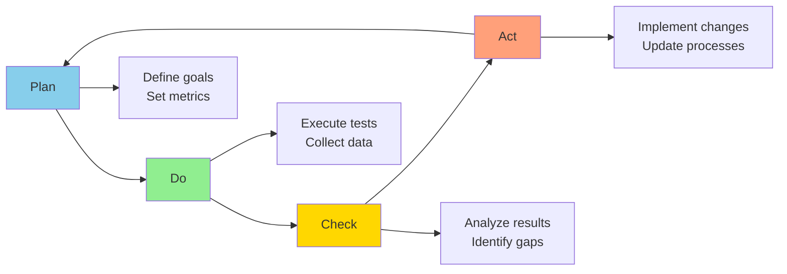

**Actions**:
- Conduct retrospectives after each release
- Analyze defect trends and root causes
- Update test strategy based on lessons learned
- Invest in training and skill development
- Adopt industry best practices
- Encourage innovation in testing approaches

---

## 17. Tools and Technology Stack

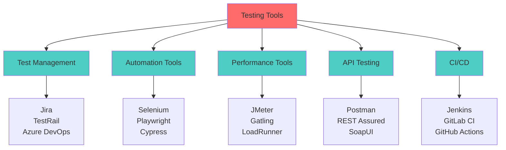

---

## 18. Approval and Sign-off

| Role | Name | Signature | Date |
|------|------|-----------|------|
| Test Manager | | | |
| Development Manager | | | |
| Project Manager | | | |
| QA Director | | | |

---

**Document Version**: 1.0  
**Last Updated**: [Date]  
**Next Review Date**: [Date + 6 months]
